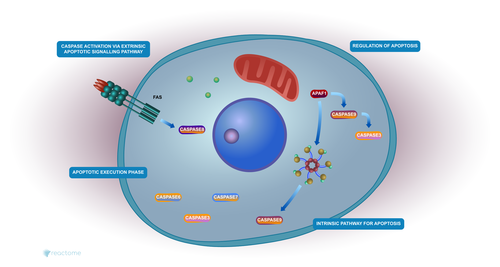

# Análisis funcional {#cap:af}
El desarrollo de las tecnologías de obtención de niveles de expresión biológica, dio lugar a grandes avances en la biología, permitiendo así pasar del análisis individual de genes o proteínas a obtener información de todo el genoma y el proteoma. Con esta información, principalmente se lleva a cabo lo que se conoce como análisis de expresión diferencial, el cual permite obtener listas de genes ó proteínas que se encuentran expresadas diferencialmente en distintas condiciones de estudio, por ejemplo, tejido tumoral vs. tejido normal.

\par Sin embargo, resulta de un gran interés biológico evaluar la interacción de todo el conjunto de genes sobre diversos mecanismos o funciones biológicas. Esta tarea se lleva a cabo consultando grandes bases de datos, conocidas como ontologías, las cuales almacenan información biológica funcional a nivel de genes. Cada ontología codifica dicha información en conjuntos de genes, cada uno, asociado a una función, localización, enfermedad particular. Cada conjunto de genes tiene un nombre o descripción del evento, y los genes específicos que se sabe interactúan para llevar a cabo ese evento.

\par Una vez determinada la información ontológica a utilizar, se aplican técnicas estadísticas para evaluar si la relación que se observa en el experimento es un evento azaroso o no, al compararlo con un comportamiento de referencia [@rivals2006enrichment]. De esta manera se obtiene para cada conjunto de genes, una probabilidad que determina si dicha función biológica está desregulada según la condición experimental bajo estudio. Este conjunto de métodos estadísticos permiten realizar el Análisis Funcional (AF) partiendo de la matriz, con niveles de expresión de cada gen (filas) para cada muestra (columnas), y la ontología a evaluar.

## Ontologías {#sec:ontologias}

En biología, las ontologías son grandes bases de datos de anotación, las cuales mediante vocabulario controlado permiten almacenar, de una manera estructurada, la información conocida. Por ejemplo, las ontologías utilizadas para el AF contienen información conocida sobre grupos de genes, que al interactuar desencadenan algún concepto o término biológico.

### Gene Ontology

Existen grandes cantidades de ontologías, cada una con hasta decenas de miles de mecanismos biológicos descriptos. En la presente tesis se analizaron las categorías de una de las ontologías de mayor difusión en la comunidad científica: Gene Ontology (GO) [@ashburner2000gene]. En esta ontología, la información se encuentra estructurada en tres categorías:

* **Funciones moleculares (FM)** describen actividades que ocurren a nivel molecular. Sin especificar dónde, cuándo, o en qué contexto, tiene lugar la acción. Las FM pueden ser tan generales como "actividad catalítica", "actividad del transportador" o "binding"; o específicas como "actividad de la adenilatociclasa".

* **Procesos biológicos (PB)** refieren a una serie de eventos realizados por uno o más conjuntos ordenados de FM. Un proceso biológico se lleva a cabo mediante un conjunto particular de FM, de una manera altamente regulada y en una secuencia temporal particular. Ejemplos de términos de PB generales son "apoptosis" o "transducción de señales". Ejemplos más específicos son "proceso metabólico de la pirimidina" o "transporte de alfa-glucósidos".

* **Componentes celulares (CC)** describen un componente de una célula, con la condición de que forme parte de un objeto más grande; puede ser una estructura anatómica (por ejemplo, un núcleo o retículo endoplásmico rugoso) o un grupo de productos génicos (por ejemplo, un ribosoma, un proteasoma o un dímero proteico). Ejemplos de CC son "parte citoplasmática de la membrana plasmática", "mitocondria" o "ribosoma". A diferencia de las otras dos categorías de GO, los conceptos de CC no se refieren a procesos sino a la anatomía celular.

En resumen, en GO se tiene la información de qué genes participan en un PB o FM, y en que CC actúan. Un ejemplo de término de GO es "apoptosis", el cual pertenece a la categoría PB, y se conforma por los genes:

```{r echo=FALSE}
conj_genes <- list("apoptosis (GO:0006915)"=c("ZBTB16", "DNAJB13", "SFRP5", "RRAGC", "IAPP", "ELMO1", "BAX", "PDCD4", "TNFSF9", "PDCD2", "PDCD1", "PTPN6", "RAF1", "CYFIP2", "PPP1R15A", "GPR65", "AHR", "TNF", "CIB1", "FOXO3", "KIAA1967", "E2F1", "AKT1", "CSE1L", "NLRP1", "PHLDA2", "FIS1", "SIAH1", "YARS", "SEMA6A", "DAXX", "GML", "GADD45B", "GADD45A", "LY86", "..."));
```

```{r print=FALSE}
conj_genes["apoptosis (GO:0006915)"]
```

Vale la pena aclarar que un gen particular puede participar en más de un término y categoría particular. Cada una de las tres categorías de GO está estructurada como un grafo acíclico dirigido (árbol), donde cada término tiene relaciones definidas con uno o más términos del mismo dominio. Cada nodo del grafo tiene asociados los genes que participan en dicho término. Cada grafo se encuentra organizado de una manera jerárquica, donde a mayor profundidad, se representa un concepto biológico más específico, y por ende, disminuye la cantidad de genes en cada término. En este sentido, un gen que se encuentra anotado en un nodo dado, también se encuentra anotado en sus nodos ancestros. En la Figura \@ref(fig:goApopttree) se puede observar el subárbol con el PB "apoptosis" y sus términos ancestros.

```{r goApopttree, echo=FALSE, fig.align='center', fig.cap="(ref:goApopttree)"}
knitr::include_graphics("images/go_apoptosis_tree.png")
```
(ref:goApopttree) Subárbol de Gene Ontology, donde se presenta el término "apoptosis" (apoptotic process) y sus términos ancestros. Imagen extraída de [https://www.ebi.ac.uk/QuickGO/term/GO:0006915](https://www.ebi.ac.uk/QuickGO/term/GO:0006915).

El vocabulario de GO está diseñado para ser agnóstico a las especies, e incluye términos aplicables a procariotas, eucariotas, organismos unicelulares y multicelulares. Las revisiones continuas de la ontología están a cargo de un equipo de editores de ontología con amplia experiencia en biología y representación de conocimientos computacionales.

### Otras ontologías

Si bien en la presente tesis se analizó la ontología GO, existen cientos de otras ontologías que pueden ser indagadas mediante AF. Entre estas otras ontologías existentes, debido a su gran popularidad en la comunidad científica, vale la pena mencionar:

#### KEGG

La ontología provista por el KEGG [@kanehisa2000kegg] contiene, para cada término o vía metabólica, además de los genes que lo influencian, un diagrama visual que representa el conocimiento experimental sobre el mismo y varias otras funciones que interactúan. Cada diagrama contiene una red de interacciones y reacciones moleculares y está diseñado para vincular los genes del genoma con los productos génicos (principalmente proteínas) de la vía. Esto ha permitido examinar qué vías y funciones asociadas, es probable que estén codificadas en el genoma.

\par Ejemplos de términos presentes en esta ontología son "apoptosis" o "ciclo celular" (Figura \@ref(fig:keggCellCyclePathw)). En estos diagramas se identifican tres tipos de elementos: cajas rectangulares para representar productos de genes, flechas para el flujo de las reacciones, y cajas con bordes redondeados para vincular a otras vías involucradas en el proceso. A su vez, esta base de datos se complementa con un conjunto de tablas de grupos ortólogos, donde se encuentra la información de subvías conservadas, que son especialmente útiles para la predicción de funciones de genes.

```{r keggCellCyclePathw, echo=FALSE, fig.align='center', out.width="100%", fig.cap="(ref:keggCellCyclePathw)"}
knitr::include_graphics("images/kegg_cell_cycle_pathway.png")
```
(ref:keggCellCyclePathw) Diagrama de KEGG del "ciclo celular" (cell cycle). Imagen extraída de [www.genome.jp/kegg-bin/show_pathway?hsa04110](www.genome.jp/kegg-bin/show_pathway?hsa04110).

\par Según los desarrolladores, es una "representación informática" del sistema biológico, formada por bloques de construcción y diagramas de cableado, más específicamente, bloques de construcción de genes o proteínas, bloques de construcción de químicos de pequeñas moléculas y reacciones, y diagramas de cableado de interacción molecular y redes de reacción.

#### BioCarta

BioCarta [@nishimura2001biocarta] fue creado por un grupo de científicos e ingenieros que reconocieron las limitaciones y obsolescencia de la literatura científica de la época. Es muy similar a la ontología del KEGG en el sentido que cada conjunto de genes viene acompañado de un diagrama de las interacciones. Sin embargo, en esta ontología, los diagramas presentan un mayor detalle gráfico como se puede observar en la Figura \@ref(fig:biocartaCorticosPathw), donde se presenta el diagrama del término "corticosteroides y cardioprotección".

```{r biocartaCorticosPathw, echo=FALSE, fig.align='center', out.width="100%", fig.cap="(ref:biocartaCorticosPathw)"}
knitr::include_graphics("images/biocarta_corticosteroids_pathway.png")
```
(ref:biocartaCorticosPathw) Diagrama de BioCarta del término "corticosteroides y cardioprotección". Imagen extraída de [https://david.ncifcrf.gov/biocarta.jsp?path=h_gcrPathway$Corticosteroids+and+cardioprotection&termId=30000124](https://david.ncifcrf.gov/biocarta.jsp?path=h_gcrPathway$Corticosteroids+and+cardioprotection&termId=30000124).

\par La principal diferencia de BioCarta con KEGG, es que BioCarta fue diseñado para proporcionar un foro para la difusión de información, así como para promover la colaboración entre investigadores, educadores y estudiantes. BioCarta alienta a los científicos a contribuir con contenidos relacionados con sus áreas específicas de especialización. De esta manera, se espera que la contribución de un gran número de especialistas en ciencias de la vida en muchos campos diferentes permita la construcción de modelos detallados y precisos de las interacciones de los productos génicos que superen los esfuerzos de un solo grupo.

#### Reactome

Reactome: una base de datos de reacciones, vías y procesos biológicos. Reactome [@joshi2005reactome] está desarrollado por biólogos expertos, en colaboración con un equipo editorial, todos ellos biólogos con nivel de doctorado. El contenido tiene referencias cruzadas a muchas bases de datos bioinformáticas. El objetivo principal de Reactome es representar visualmente las vías biológicas con todo detalle mecanicista, a la vez que se ponen a disposición los datos de la fuente en un formato computacionalmente accesible.

\par La unidad central del modelo de datos de Reactome es la reacción. Las entidades (genes, proteínas, complejos y pequeñas moléculas) que participan en las reacciones forman una red de interacciones biológicas y se agrupan en vías. Ejemplos de vías biológicas en Reactome incluyen la "función inmune innata y adquirida", la "regulación transcripcional", y como se detalla en la Figura \@ref(fig:reactomeApoptPathw), la "apoptosis".

```{r reactomeApoptPathw, echo=FALSE, fig.align='center', out.width="100%", fig.cap="(ref:reactomeApoptPathw)"}

```
(ref:reactomeApoptPathw) Diagrama de Reactome del término "apoptosis". Imagen extraída de [https://www.reactome.org/content/detail/R-HSA-109581](https://www.reactome.org/content/detail/R-HSA-109581).

\par Las vías representadas en Reactome son específicas para cada especie, y cada paso de la vía está respaldado por citas bibliográficas que contienen una verificación experimental del proceso representado. Si no existe una verificación experimental, las vías pueden contener pasos inferidos, pero sólo si un biólogo experto, nombrado como _autor de la vía_, y un segundo biólogo, nombrado como _revisor_, están de acuerdo en que esto es una inferencia válida a hacer. Las vías humanas se utilizan para generar computacionalmente, mediante un proceso basado en la ortología, las vías derivadas de otros organismos. 

#### MSigDB

MSigDB [@liberzon2011molecular] es la ontología desarrollada por el Broad Institute ([https://www.broadinstitute.org/](https://www.broadinstitute.org/)), esta ontología es un compilado de ciertos conjuntos de genes provenientes de otras ontologías, entre ellas las descriptas previamente. MSigDB agrupa todos sus conjuntos de genes dentro de ocho categorías:

* **Conjuntos de genes distintivos**: resumen y representan estados o procesos biológicos específicos bien definidos. Estos conjuntos de genes fueron generados por una metodología computacional basada en la identificación de superposiciones entre conjuntos de genes en MSigDB y la retención de genes que muestran detalles de expresión coordinada.
* **Conjuntos de genes posicionales**: correspondientes a cada cromosoma humano y a cada banda citogenética que tenga al menos un gen.
* **Conjuntos de genes curados**: obtenidos y curados a partir de diversas fuentes, como bases de datos de ontologías (KEGG, BioCarta y Reactome), literatura biomédica y el conocimiento de expertos en la materia.
* **Conjuntos de genes del motivo**: representan objetivos potenciales de regulación por factores de transcripción o microARNs. Los conjuntos consisten en genes agrupados por contener motivos de secuencia corta en común, pertenecientes a regiones codificadoras no proteicas. Los motivos representan elementos de regulación cis conocidos o probables en promotores y 3'-UTRs.
* **Conjuntos de genes computacionales**: definidos por la minería de grandes colecciones de datos orientados al cáncer.
* **Conjuntos de genes de GO**: contienen conjuntos de genes seleccionados de GO.
* **Firmas oncogénicas**: representan firmas de vías celulares que a menudo están desreguladas en el cáncer. La mayoría de las firmas se generaron directamente a partir de datos de genes que implicaban la perturbación de genes cancerígenos conocidos.
* **Firmas inmunológicas**: representan estados celulares y perturbaciones dentro del sistema inmunológico. Las firmas fueron generadas por la curación manual de estudios publicados en inmunología humana y de ratones.

## Metodologías de Análisis Funcional (AF) {#sec:af}

El análisis funcional refiere a técnicas que permiten, dado un experimento, evaluar el impacto de la interacción de grupos de genes sobre características biológicas. Partiendo de una matriz de expresión de genes con muestras pertenecientes a una de dos condiciones, los algoritmos de AF buscan detectar aquellos términos biológicos que se encuentran desregulados entre ambas condiciones. Una vez determinada la base de datos ontológica de interés, el investigador debe seleccionar cuál técnica de AF utilizar.

\par Se diferencian dos categorías de algoritmos para llevar a cabo el AF [@huang2008bioinformatics]. La principal diferencia entre estas categorías es la estrategia que llevan a cabo para el análisis:

### Análisis de Sobre-Representación (ASR) {#sec:asr}

Esta metodología requiere definir la lista de genes de interés o **candidatos**, generalmente aquellos que se encuentran diferencialmente expresados en el experimento, es decir, un vector con los nombres de los genes. Adicionalmente requiere de una segunda lista de genes, que utiliza para especificar lo que es esperable como comportamiento de **referencia** del modelo biológico, generalmente todos los genes presentes en el experimento. Luego, para cada término, realiza de forma independiente un test de hipótesis comparando las proporciones observadas sobre los candidatos con respecto a la referencia. De este modo, para cada término se obtiene un p-valor asociado que denota si existe evidencia de que las proporciones son diferentes.

\par En la Figura \@ref(fig:diagramaORA) se puede apreciar un diagrama de lo que sería el proceso completo para llevar a cabo un ASR. De este diagrama se desprenden varios aspectos que resultan variables. Diversos autores han propuesto diferentes test de hipótesis [@huang2008systematic; @fang2014thednet; @fresno2013rdavidwebservice; @falcon2006using], y principalmente de allí es que surgen grandes cantidades de alternativas de ASR. Más aún, la elección de la lista de referencia no queda del todo clara, y se desprenden dos sugerencias con gran validez estadística: utilizar todos los genes del experimento (como en la Figura \@ref(fig:diagramaORA)), o utilizar todo el genoma de la especie en cuestión [@fresno2012multi].

\newpage
```{r diagramaORA, echo=FALSE, fig.align='center', out.width="100%", fig.cap="(ref:diagramaORA)"}
knitr::include_graphics("images/diagrama_ORA.png")
```
(ref:diagramaORA) Diagrama clásico del proceso completo de Análisis de Sobre-Representación (ASR). Este proceso parte de una Matriz de expresión, con Genes en filas y Muestras en columnas, y la etiqueta de condición de cada muestra (C1 y C2). Mediante un algoritmo de Detección de Genes Diferenciales (DGD) se obtiene para cada gen un p-valor asociado (p-vals). Aplicando un nivel de corte $\alpha$ a estos p-valores ($< \alpha$), se obtiene cuáles son Genes Diferenciales (GD) y cuáles no. Aquí es donde efectivamente comienza el ASR, los algoritmos de ASR requieren de dos listas: la de genes candidatos (usualmente los GD), y la Lista de Referencia (LR; usualmente todos los genes detectados en el experimento). A partir de estas listas de genes, para cada Conjunto de Genes (CG$_i$) se genera una tabla de contingencia, a la cual se le aplica un Test de Hipótesis (TH) del cual resulta un p-valor asociado al CG$_i$ (p-val$_i$).

### Puntuación Funcional de Clase (PFC)
Esta metodología construye un ordenamiento de los genes a partir de la totalidad del perfil de expresión. El objetivo es determinar si todos los miembros de una característica biológica de interés, están distribuidos aleatoriamente o no (en algún extremo) a lo largo del ordenamiento generado [@subramanian2005gene]. Para ello, los genes se organizan mediante algún criterio de ordenamiento que refleje la diferencia entre ambas condiciones bajo estudio, por ejemplo, para cada gen obtener la diferencia de medias entre ambas condiciones. Luego, para un término biológico en particular, se recorre este ordenamiento para calcular el máximo del enriquecimiento inducido, lo cual se conoce como **Enrichment Score** (ES) del término. Para ello, a cada gen se le aplica una función de coste que aumenta (o disminuye) proporcionalmente a la correlación de su nivel de expresión con el fenotipo de las condiciones, cada vez que encuentra un gen que pertenece (o no) a la lista de miembros de la categoría de interés. Este ES se compara con la distribución nula generada por las permutaciones en las etiquetas de las condiciones, con el fin de evaluar si el ordenamiento original es esperable o generado por azar. En caso de que difiera del azar, existen diferentes criterios para definir, para el experimento dado, cuáles son los genes más influyentes en el término. Normalmente se utilizan los genes más cercanos al máximo del ES, o los genes pertenecientes al segmento más pequeño entre el coste máximo y el principio o el final de la lista ordenada.

\par En la Figura \@ref(fig:diagramaFCS) se observa el diagrama de lo que sería un proceso completo de PFC. De este diagrama, diversos aspectos difieren dependiendo del algoritmo de PFC a utilizar. Por ejemplo, ciertos algoritmos sugieren hacer permutación en las etiquetas de los genes, otros en las etiquetas de las muestras, y finalmente otros, en las etiquetas de genes del ordenamiento generado. Más aún, la principal diferencia entre uno y otro algoritmo de PFC reside en la función de ES, si bien la idea por detrás resulta similar, las ponderaciones de cada gen varían. Finalmente, vale la pena mencionar que ciertos algoritmos fijan diferentes filtros de los conjuntos de genes a analizar ya que suponen que fuera de esos límites el algoritmo pierde potencia estadística.

```{r diagramaFCS, echo=FALSE, fig.align='center', out.width="100%", fig.cap="(ref:diagramaFCS)"}
knitr::include_graphics("images/diagrama_FCS.png")
```
(ref:diagramaFCS) Diagrama clásico del proceso completo de Puntuación Funcional de Clase (PFC). Este proceso parte de una Matriz de expresión, con Genes en filas y Muestras en columnas, y la etiqueta de de condición de cada muestra (C1 y C2). Mediante alguna función particular (f) se obtiene un ordenamiento real (o$^r$) para los genes, es decir, para cada gen un valor numérico que le asigna una posición de orden. Luego, mediante una función llamada Enrichment Score (ES), partiendo de un conjunto de genes particular (CG$_i$) y el ordenamiento, se obtiene un valor de enriquecimiento real para el conjunto de genes (ES$^r_i$). Esta función ES es diferente dependiendo del algoritmo de PFC utilizado. Luego, mediante permutaciones sobre las condiciones, las etiquetas de los genes, ó del ordenamiento, se generan nuevos vectores de ordenamiento (o$^*_1$, o$^*_2$, ..., o$^*_n$). Con cada uno de estos ordenamientos permutados, se genera un valor de enriquecimiento permutado para el conjunto de genes (ES$^{*1}_i$, ES$^{*2}_i$, ..., ES$^{*n}_i$). Dado que se cuenta con n muestras permutadas de valores de enriquecimiento, se procede a realizar una distribución nula, con la cual se compara contra el valor de enriquecimiento real ES$^r_i$, y por ende se obtiene un p-valor asociado al conjunto de genes dado (p-val$_i$).

### Análisis de Enriquecimiento Modular
Vale la pena mencionar que en la literatura se suele encontrar una tercer alternativa de AF, llamada Análisis de Enriquecimiento Modular. Esta metodología requiere, adicionalmente, que los CG presenten alguna relación entre ellos. En la presente tesis no se tiene en cuenta esta metodología ya que en el común de las bases de datos de CG no existe relación entre sus términos, lo cual resulta en un gran limitante para el análisis.

## Comentarios finales

Tanto el ASR como PFC se utilizan para saber si un término se enriquece (o no) en la comparación de las condiciones estudiadas. Sin embargo, la formulación del problema es diferente para cada caso. Para realizar el análisis a través del ASR es necesario proporcionar dos listas, una de ellas de referencia y la otra de los genes candidatos. Este último suele estar formado por aquellos genes que se han identificado como expresados de forma diferencial entre dos condiciones experimentales (por ejemplo, tumor vs. normal) para un umbral definido. En PFC, se utiliza una matriz de expresión única que contiene todos los genes detectados por el experimento y, a continuación, se utiliza el criterio de ordenación propuesto para medir el enriquecimiento. En este sentido, PFC en comparación al ASR, no utiliza un umbral para definir la lista de candidatos, y por ende PFC utiliza toda la información presente en el experimento.

\par Si bien, existen principalmente dos metodologías para realizar el AF, tanto para ASR como para PFC, existen grandes cantidades de diferentes algoritmos desarrollados, cada uno con sus propios supuestos, test, y parametrizaciones. En este sentido, no fue evaluado qué beneficios trae un algoritmo frente al resto. Por consiguiente, para el investigador, la elección del algoritmo de AF a utilizar termina siendo más una cuestión de elección aleatoria, que una elección adaptada al experimento en cuestión, de la hipótesis bajo estudio, o del enfoque de la investigación.
